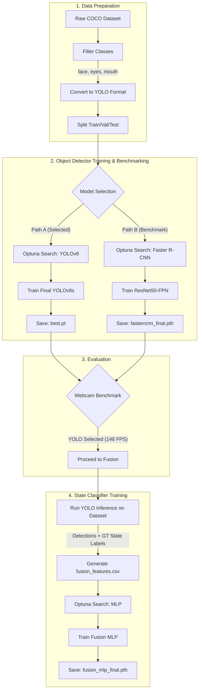
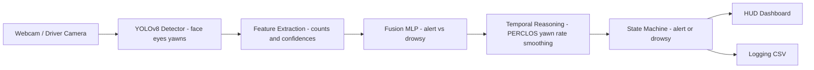

# Live Driver Drowsiness Detection (YOLOv8 + Fusion MLP)

This repository contains a real-time driver drowsiness detection system built for a university Computer Vision & Deep Learning module. The system employs a hybrid architecture, utilising **YOLOv8** for extraction of facial cues and a **Fusion MLP (Multi-Layer Perceptron)** to classify the driver's state based on those cues.

The entire pipeline—from dataset conversion and hyperparameter tuning to the final real-time Head-Up Display (HUD)—is contained within:

`YOLO_v8_setup.ipynb`

## Repository Structure

```text
.
├── YOLO_v8_setup.ipynb          # MAIN FILE: Contains Data Prep, Training, Eval, and HUD
├── fusion_mlp_final.pth         # Trained MLP Weights
├── model/
│   └── yolo/
│       └── final_best_model6/
│           └── weights/
│               └── best.pt      # Trained YOLOv8 Weights
├── font/
│   └── Audiowide-Regular.ttf    # Custom font for HUD
└── data/
    ├── labeled_images/          # Raw Images & JSONs
    └── yolo_splits/             # Processed YOLO Dataset
```
**Runtime Outputs:**

- fusion_yolo_features.csv: Extracted feature set used for MLP training.

- drowsiness_log.csv: Real-time log of driver state during webcam execution.

## Training Pipeline

This diagram illustrates the complete workflow contained in `YOLO_v8_setup.ipynb`, including the benchmarking branch and the hybrid feature fusion strategy.



---

## Methodology & Logic

This project moves beyond simple end-to-end image classification by breaking the problem into two distinct stages: **Visual Feature Extraction** (Object Detection) and **State Classification** (Tabular Neural Network). This decoupling allows the system to be interpretable—we know *why* the model thinks the driver is drowsy (e.g., "too many yawns" vs. "eyes closed").

### 1. Dataset Preparation & Cleaning
The dataset was originally annotated using **Roboflow**, where bounding boxes were drawn around specific facial features.

- **Source Format:** COCO JSON (`_annotations.coco.json`).
- **Annotated Classes:** `face`, `eyes_open`, `eyes_close`, `mouth_close`, `yawn`, `uncertain`.
- **Data Cleaning Logic:**
  - The raw dataset contained metadata tags (`alert`, `drowsy`) mixed with visual bounding box labels.
  - **Filtering:** We stripped the dataset of these non-visual state labels for the Object Detection phase. This forces the YOLO model to learn *only* physical features (eyes, mouth), preventing it from biasing its detection based on image-level metadata.
  - **Splitting:** The clean data was split into **Train (70%)**, **Validation (15%)**, and **Test (15%)** sets and converted into standard **YOLO format**.

### 2. Object Detector Training (YOLOv8)
We utilised the **Ultralytics YOLOv8** architecture to detect facial states.

- **Architecture Selection:** We evaluated `yolov8n` (nano) and `yolov8s` (small).
- **Hyperparameter Optimisation (Optuna):**
  - We used **Optuna** to automate the search for optimal training hyperparameters.
  - **Parameters Tuned:** Learning rate (`lr0`), momentum, weight decay, batch size, and optimiser (`SGD` vs `Adam` vs `AdamW`).
  - **Outcome:** The **YOLOv8s (Small)** model with the **Adam** optimiser yielded the best balance of mAP and inference speed.
- **Performance:**
  - **mAP@0.5:** 0.945
  - **Precision:** 0.948
  - **Recall:** 0.908

### 3. Model Comparison: YOLOv8 vs Faster R-CNN
To validate our choice of backbone, we benchmarked YOLOv8 against a traditional two-stage detector, **Faster R-CNN (ResNet50-FPN)**.

- **Training:** Faster R-CNN was also tuned using Optuna to ensure a fair comparison.
- **Evaluation:** Both models were subjected to a side-by-side **Webcam Benchmark**.

| Metric | YOLOv8 (Selected) | Faster R-CNN | Decision Logic |
| :--- | :--- | :--- | :--- |
| **Latency** | ~6.75 ms | ~37.96 ms | YOLO is ~5.6x faster, critical for safety monitoring. |
| **Throughput** | ~148 FPS | ~26 FPS | Faster R-CNN creates video lag, unsuitable for real-time alerts. |
| **Confidence** | High (0.73 avg) | Moderate (0.65 avg) | YOLO detections flickered less between frames. |
| **Artifacts** | Low | High | Faster R-CNN often predicted multiple overlapping boxes for the same eye. |

**Note:** Note that the exact values changes each time the demo runs, so average values are taken instead.

**Conclusion:** YOLOv8 was selected as the primary backbone for its superior real-time performance.

### 4. Fusion MLP Classifier (The Hybrid Approach)
Instead of relying on simple thresholds (e.g., "if eye closed > 2 seconds, alarm"), we trained a secondary neural network to learn complex relationships between features.

- **Feature Engineering:** The trained YOLOv8 model was run over the dataset to generate a tabular CSV (`fusion_yolo_features.csv`). Each frame is represented by:
  - **Counts:** Number of open eyes, closed eyes, yawns, etc.
  - **Confidences:** Average and Max confidence scores per class.
- **Architecture:** A Feed-Forward Multi-Layer Perceptron (MLP).
  - **Structure:** Sequential Linear Layers → ReLU → Dropout.
  - **Hyperparameter Search:** Optuna tuned the number of layers (1-4), hidden dimension size (16-128), and dropout rate.
- **Training:** The MLP maps these numerical features to the ground truth driver state (`Alert` vs `Drowsy`).
- **Result:** **93% Accuracy** on the test set.

### 5. Temporal Reasoning & State Machine
Single-frame classification is noisy. To prevent false alarms, we implemented a temporal logic layer in the runtime loop:

1.  **PERCLOS (Percentage of Eye Closure):** Calculates the ratio of closed eyes over a rolling **30-second window**.
2.  **Yawn Frequency:** Tracks the number of distinct yawns over a **60-second window**.
3.  **Probability Smoothing:** The raw output of the MLP is smoothed using a **deque history** to remove jitter.
4.  **Hysteresis (State Stickiness):** The system will not switch from `ALERT` to `DROWSY` unless the fatigue threshold is exceeded for a sustained **5 seconds**. This prevents the alarm from triggering due to a single blink.

---

## Runtime Model Flow

The system operates as a linear pipeline during live execution:

1. **Input**: Captures frame from webcam.

2. **YOLOv8**: Locates faces, eyes, and mouths.

3. **Feature Extractor**: Converts YOLO boxes into a mathematical vector (e.g., `[2_eyes_open, 0_yawns, 0.95_conf]`).

4. **Fusion MLP**: Predicts raw probability of drowsiness (0.0 to 1.0).

5. **Temporal Reasoning**: Smooths the probability over time and calculates PERCLOS.

6. **HUD**: Renders the dashboard overlay.

7. **CSV Logs**: Saves row of data for every single frame processed by the webcam loop.

## 💾 Model Artifacts & Checkpoints
The notebook automatically saves the following files during execution. Ensure these are present before running the HUD.

| Stage | File Path | Description |
| :--- | :--- | :--- |
| **YOLO Training** | `model/yolo/final_best_model6/weights/best.pt` | The optimised weights for the visual object detector. |
| **MLP Training** | `fusion_mlp_final.pth` | The trained weights for the state classifier (Alert vs Drowsy). |
| **Faster R-CNN** | `model/fasterrcnn_final/fasterrcnn_final.pth` | (Optional) Saved only if you run the comparison benchmark. |

## Real-Time HUD Interface

The system features a custom **OpenCV-based Head-Up Display (HUD)** designed to mimic a Tesla driver monitor.

- **Driver View (Left Panel):**

    - **State Label:** Displays "ALERT" (Green) or "DROWSY" (Red).

    - **Probability Gauge:** A circular gauge visualising the model's certainty of drowsiness.

    - **PERCLOS:** Real-time metric showing eye closure percentage.

    - **Yawns/Min:** Counter for recent yawn frequency.

- **Video Feed (Right Panel):** Shows the live camera feed with YOLO bounding boxes.

- **Bottom Graphs:**

    - **Fatigue Trend:** A line graph tracking the driver's fatigue score over the last few minutes.

    - **Yawn Activity:** A binary plot showing when yawns were detected.


## Limitations
- **Sunglasses:** The YOLO model relies heavily on eye state. Sunglasses occlude the eyes, causing the "Uncertain" class to trigger and potentially lowering accuracy.

- **Lighting Conditions:** Extreme darkness or backlighting can cause YOLO to miss facial features.

- **Single Driver Assumption:** The logic assumes only one face is present. Multiple faces in the frame may cause feature counts to aggregate incorrectly (e.g., 4 eyes detected).

- **Hardware:** While YOLOv8 is efficient, achieving smooth real-time performance (>30 FPS) generally requires a CUDA-capable GPU.

## Installation & Usage

### 1. Install Dependencies
``` bash
pip install ultralytics==8.3.40 opencv-python torch torchvision numpy pandas scikit-learn optuna matplotlib seaborn tqdm pillow pyttsx3==2.90
```
### 2. Run the Project

#### 1. Clone the repository:
``` bash
git clone [https://github.com/Lmaberd/CVDL-Live-Drowsiness-Detection.git](https://github.com/Lmaberd/CVDL-Live-Drowsiness-Detection.git)
```
#### 2. Open `YOLO_v8_setup.ipynb` in Jupyter Notebook.

#### 3. **To Skip Training:** Scroll to the very bottom of the notebook and run the Final HUD Code Cell (ensure weights are present).

### 3. Controls
- `q`: Quit the application.

- `f`: Toggle fullscreen mode.
---
## Future Improvements
- **Gaze Tracking:** YOLO detects eyes, but not gaze direction. Adding iris tracking could detect distraction.

- **Head Pose Estimation:** Detecting head nodding/drooping via Perspective-n-Point algorithms.

- **Edge Optimisation:** Exporting models to ONNX or TensorRT for faster inference.
---
## FAQ

### **What is the `face` class used for?**
The `face` tag represents the driver’s head/face region. It is used for:
- **Driver presence detection:** If no face is detected, the frame is considered unreliable (driver missing or camera misaligned).
- **Spatial anchoring:** Eye-related detections must fall inside the face box, preventing false positives in the background.
- **Feature input for the Fusion MLP:** Face confidence and presence are used as part of the feature vector, improving overall stability of the drowsiness prediction.

---

### **What does the `uncertain` class mean?**
`uncertain` is a special class used **exclusively for sunglasses**.

Whenever the driver is wearing sunglasses, the detector cannot reliably classify eyes as open or closed. Instead of incorrectly forcing them into `eyes_open` or `eyes_close`, these regions are labeled as **uncertain**.

This serves two purposes:
- **Detection reliability:** The system knows that eye state signals cannot be trusted during sunglasses.
- **Runtime handling:** The real-time HUD triggers a “Please remove your sunglasses” message when `uncertain` appears consistently.

---

### **Why not classify sunglasses as closed eyes?**
Because this would:
- artificially inflate PERCLOS (making the driver look falsely drowsy),
- break the Fusion MLP’s feature logic,
- and cause incorrect or excessive drowsiness alerts.


---
## Acknowledgements
Built for a Computer Vision & Deep Learning module. Powered by **YOLOv8 (Ultralytics), PyTorch, Optuna, OpenCV, and Pillow**.
