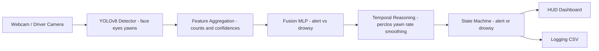
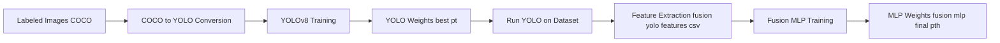

# Live Driver Drowsiness Detection (YOLOv8 + Fusion MLP)

This repository contains a real-time driver drowsiness detection system built for a university Computer Vision & Deep Learning module.  
The system uses YOLOv8 for facial cue detection and a Fusion MLP classifier for determining driver alertness.

Everything — dataset conversion, model training, feature engineering, and the final real-time HUD — is contained within:

`YOLO_v8_setup.ipynb`

Pretrained models are included for immediate demo usage.

---

## Runtime Model Flow 



## Repository Structure

```text
.
├── YOLO_v8_setup.ipynb
├── fusion_mlp_final.pth
├── model/
│   └── yolo/
│       └── final_best_model6/
│           └── weights/
│               └── best.pt
├── font/
│   └── Audiowide-Regular.ttf
└── data/
    ├── labeled_images/
    │   ├── images/
    │   ├── _annotations.coco.json
    │   └── _annotations.filtered.json
    └── yolo_splits/
        ├── images/{train,val,test}/
        ├── labels/{train,val,test}/
        └── data.yaml
```

Runtime outputs (created when you run the notebook):

- `fusion_yolo_features.csv`
- `drowsiness_log.csv`

---

## Project Overview

The system detects signs of drowsiness through a hybrid approach.

### 1. YOLOv8 Object Detection

The YOLOv8 model detects:

- `eyes_open`  
- `eyes_close`  
- `yawn`  
- `face`  
- `uncertain`  

YOLO detections are converted into structured numerical features per frame.

---

### 2. Fusion MLP Classifier

The Fusion MLP predicts the driver state:

- Alert  
- Drowsy  

It is trained using:

- YOLO detection counts  
- Mean confidence per class  
- Yawn presence  
- Eye state distribution  
- Driver-level labels from the annotated dataset  

Model checkpoint is saved as:

```text
fusion_mlp_final.pth
```

---

### 3. Temporal Reasoning

To improve reliability over time, the system applies:

- Probability smoothing over a sliding window  
- PERCLOS (percentage of closed-eye frames)  
- Yawns per minute  
- Eye visibility tracking (to detect sunglasses or occlusion)  
- Hysteresis logic to avoid rapid flickering between ALERT and DROWSY  

---

### 4. Real-Time HUD Interface

The final section of the notebook launches a real-time dashboard featuring:

- Webcam feed  
- ALERT / DROWSY label  
- Probability gauge  
- Probability timeline  
- Yawn counters  
- Eye-state detection panel  
- Text-to-Speech alerts  
- Sunglasses warnings  

Controls:

- `q` → quit  
- `f` → toggle fullscreen  

---

## Installation

Recommended: use a virtual environment.

```bash
pip install ultralytics==8.3.40 opencv-python torch torchvision     numpy pandas scikit-learn optuna matplotlib seaborn tqdm pillow pyttsx3==2.90
```

You may also run the installation cell inside the notebook.

---

## How to Run (Quick Demo – No Training Required)

1. Clone or download the repository:

```bash
git clone https://github.com/Lmaberd/CVDL-Live-Drowsiness-Detection.git
```

2. Install dependencies (see the Installation section above).

3. Launch the notebook:

```bash
jupyter notebook YOLO_v8_setup.ipynb
```

4. Scroll to the final HUD section.

5. Ensure pretrained weights exist:

```text
model/yolo/final_best_model6/weights/best.pt
fusion_mlp_final.pth
```

6. Run the final cell to start the real-time HUD.

---

## Full Pipeline (If Reproducing Everything)

### Training Flow Overview


If you want to reproduce the full pipeline from scratch, the notebook guides you through:

### 1. Convert COCO → YOLO

- Filter relevant classes  
- Create YOLO train/validation/test splits  
- Generate `data.yaml`  

### 2. Train YOLOv8 (optional)

- Run hyperparameter tuning with Optuna  
- Train the final YOLOv8 model  

Weights are saved at:

```text
model/yolo/final_best_model6/weights/best.pt
```

### 3. Generate Feature Dataset

Run YOLOv8 over the labeled images and export engineered features:

```text
fusion_yolo_features.csv
```

### 4. Train Fusion MLP (optional)

- Train/Validation/Test split  
- Optuna hyperparameter search  
- Train final MLP  

Checkpoint is saved as:

```text
fusion_mlp_final.pth
```

### 5. Launch Final HUD

- Runs YOLOv8 + Fusion MLP in real time  
- Computes PERCLOS and yawns per minute  
- Smooths probabilities  
- Renders the HUD  
- Produces audio alerts when drowsiness is detected  

---

## Limitations

- Sensitive to lighting conditions and sunglasses (Recommended to remove sunglasses for better accuracy) 
- Assumes a single driver in the frame  
- Dataset size and diversity limit generalisation  
- Not yet optimised for mobile or embedded deployment  

---

## Future Improvements

- Head pose estimation  
- Gaze tracking  
- ONNX or TensorRT deployment for faster inference  
- Phone/distraction detection  
- Larger and more diverse training dataset  

---

## Acknowledgements

This project was built as part of a Computer Vision & Deep Learning university module.

Powered by:

- YOLOv8 (Ultralytics)  
- PyTorch  
- OpenCV  
- Optuna  
- Pillow